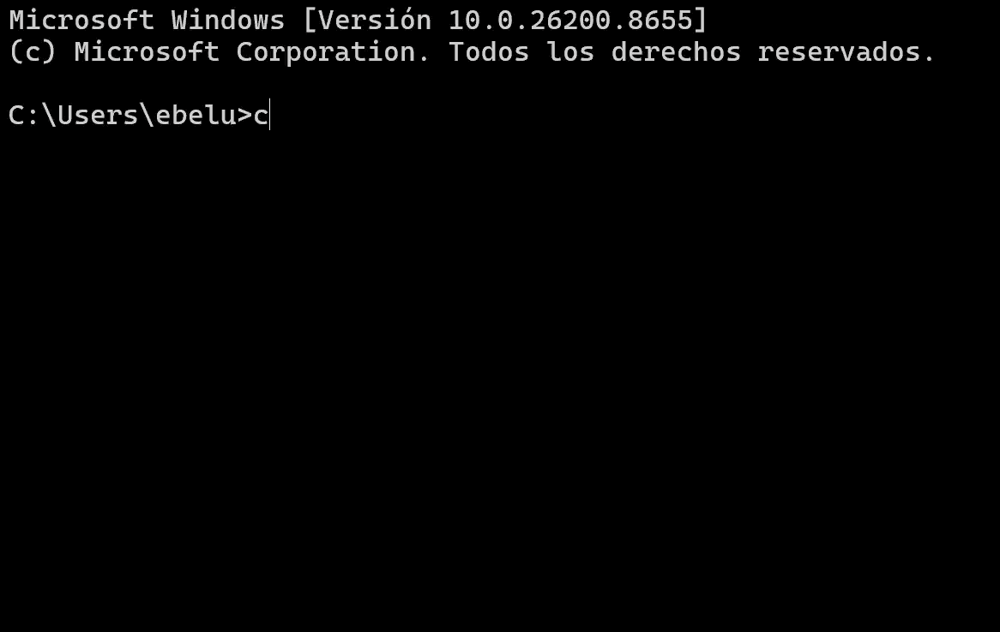

# countdown (Windows Edition)

Temporizador de cuenta regresiva para la terminal, con números grandes, pausa/reanudación y aviso por voz — pensado para **CMD / PowerShell de Windows 11**.

Inspirado en [antonmedv/countdown](https://github.com/antonmedv/countdown) (Go, macOS/Linux), reescrito en Python para funcionar de forma nativa en Windows.



## Instalación

Requiere [Python 3.8+](https://www.python.org/downloads/).

1. Clona el repositorio:
   ```cmd
   git clone https://github.com/TU_USUARIO/countdown-windows.git
   cd countdown-windows
   ```
2. (Opcional, recomendado) Añade la carpeta al PATH para poder usar `countdown` desde cualquier sitio:
   - Busca "Variables de entorno" en el menú inicio → "Editar las variables de entorno del sistema"
   - "Variables de entorno..." → en "Variables de usuario", selecciona `Path` → "Editar" → "Nuevo"
   - Pega la ruta completa a la carpeta del repo (donde están `countdown.py` y `countdown.bat`)
   - Acepta todo y abre una **nueva** ventana de CMD

## Uso

```cmd
countdown 25s
countdown 11:32
countdown 1m30s && echo Listo!
countdown -up 30s
countdown -title "Pomodoro" 25m
countdown -say 10s 1m
```

Si no añadiste la carpeta al PATH, usa:
```cmd
python countdown.py 25s
```

### Formato de duración
`1h2m3s`, `90s`, `1m30s`, etc. También admite una hora objetivo: `14:15`, `02:15pm`.

### Flags
| Flag | Descripción |
|---|---|
| `-up` | Cuenta hacia arriba desde cero en vez de hacia abajo |
| `-say N` | Anuncia en voz alta (TTS de Windows) los últimos N segundos |
| `-title "texto"` | Muestra un título debajo del temporizador |

### Teclas
| Tecla | Acción |
|---|---|
| `Espacio` | Pausar / reanudar |
| `Esc` o `Ctrl+C` | Detener (no ejecuta el comando encadenado con `&&`) |

## Cómo funciona

- Usa secuencias ANSI (soportadas de forma nativa en CMD/PowerShell de Windows 10/11) para dibujar los números grandes y evitar parpadeo, redibujando solo cuando cambia el segundo mostrado.
- La detección de teclas (`Espacio`, `Esc`) usa el módulo `msvcrt`, exclusivo de Windows.
- El aviso por voz usa `System.Speech` a través de PowerShell, como equivalente Windows del comando `say` de macOS.

## Licencia

MIT — ver [LICENSE](LICENSE).
